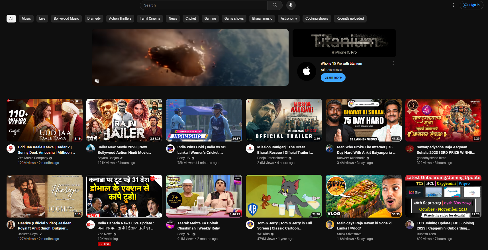
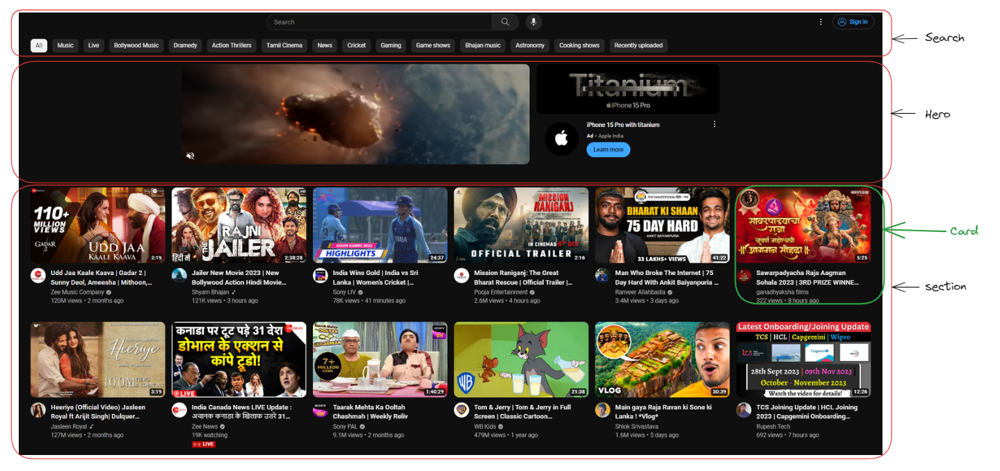

# Assignment 

Until now we have covered topics like:
- What is `React`.
- What is `JSX` and how to work with it.
- What are components and how to create them also how to pass data to it.
- How to add `tailwindcss` to our vite project.
- Have studied more about `package.json`.
- How to deploy it [netlify](https://www.netlify.com/)

> **Note**
You don't have to create the sidebar.

Using the above knowledge you have to create a [youtube](www.youtube.com) page clone that is responsive.

Component View

## Things to keep in mind
- Make sure you use symantic tags
- Make sure that you use tailwindcss for styling.
- You may install other `npm` packages if you want to do so.
- Finally you have to deploy your website on `netlify`.

## How to do the assignment
- I have provided you with a zip file.
- Extract it and open it in your code editor. (In case if you are note able to do that then go to github to access this particular folder and download it from there)
- I have created a basic skeleton for you guys i.e. I have created the components and have also imported them in the `App.jsx` file also the assets are in the `public` folder. (In case you want to add or remove anything then you are free to do so)
- You have to complete the assignment in the `src` folder.
- Mare sure to make it as close as possible to this [particular image](./public/img/assignment_2_img.png).
- **Last day for submission will be on Saturday (30 Sept)**

> **Note**
> Make sure you hit `npm install` before you start working on the assignment.

## Marks distribution for Assignment 2: Total Marks - 25
- Able to deploy: 5 marks
- How close it is to the actual website: 10 marks
- Responsive: 5 marks
- Code quality: 5 marks

## How to deply your app on netlify
- Go the path where your project is and run `npm run build` in yout vite app. It should create a `dist` folder in your project.
- Go to [netlify](https://www.netlify.com/) and login with your `github` account.
- Click on deply a new website.
- Select deply manually.
- Drag and drop the `dist` folder in the drag and drop section.
- To create a `dist` folder you just have to run `npm run build` in your vite app.